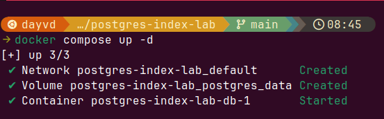
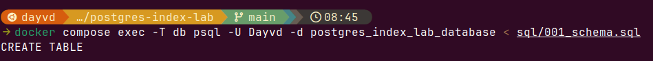
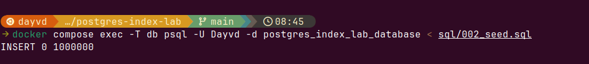
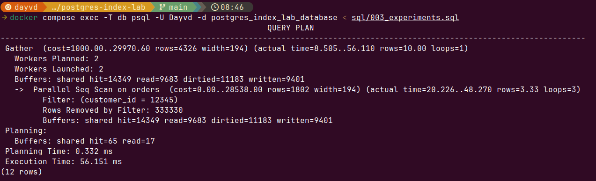
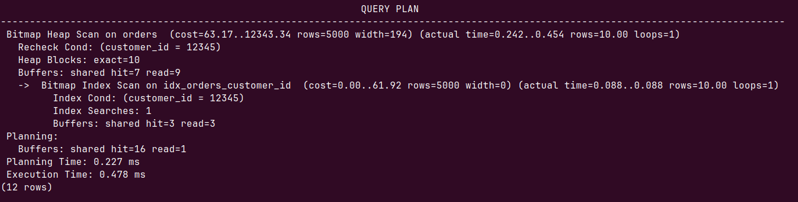

# PostgreSQL Index Lab

A hands-on laboratory for understanding PostgreSQL indexes, query planning, execution plans, and database performance.

The experiments are executed against a PostgreSQL 18 instance running in Docker with a dataset containing **1,000,000 rows**.

---

# Lab 1 — B-tree Index

## Objective

Understand how PostgreSQL changes its execution strategy when a B-tree index is introduced.

We will compare the same query:

1. Without an index
2. With a B-tree index

The goal is not only to measure execution time, but also to understand **why PostgreSQL chooses a different execution plan**.

---

## 1. Start PostgreSQL

The PostgreSQL instance is started using Docker Compose:

```bash
docker compose up -d
```

This creates the PostgreSQL container, network, and persistent volume.



The container is running successfully:

```text
Container postgres-index-lab-db-1 Started
```

---

## 2. Create the Schema

The `orders` table is created using:

```bash
docker compose exec -T db psql \
  -U Dayvd \
  -d postgres_index_lab_database \
  < sql/001_schema.sql
```

The command returned:

```text
CREATE TABLE
```



The schema contains fields such as:

* `customer_id`
* `status`
* `country`
* `amount`
* `description`
* `created_at`
* `email`

---

## 3. Generate the Dataset

The dataset is generated directly inside PostgreSQL using `generate_series()`.

The seed script is executed with:

```bash
docker compose exec -T db psql \
  -U Dayvd \
  -d postgres_index_lab_database \
  < sql/002_seed.sql
```

PostgreSQL returned:

```text
INSERT 0 1000000
```

This confirms that **1,000,000 rows were inserted**.



---

# Experiment 1 — Query Without an Index

Before creating the index, we execute:

```sql
EXPLAIN (ANALYZE, BUFFERS)
SELECT *
FROM orders
WHERE customer_id = 12345;
```

### Expected behavior

There is no index on `customer_id`, so PostgreSQL has no direct structure it can use to locate the matching rows.

The planner therefore has to consider a sequential scan of the table.



### Actual execution plan

In this experiment, PostgreSQL selected:

```text
Gather
  Workers Planned: 2
  Workers Launched: 2

  -> Parallel Seq Scan on orders
       Filter: (customer_id = 12345)
       Rows Removed by Filter: 333330

Execution Time: 56.151 ms
```

This is a **Parallel Sequential Scan**.

PostgreSQL used two parallel workers in addition to the leader process, resulting in three processes participating in the parallel scan.

Only **10 rows** matched `customer_id = 12345`.

The important part is:

```text
Rows Removed by Filter: 333330
```

The Parallel Seq Scan processed roughly one third of the table per process, with non-matching rows being discarded by the filter.

---

# Experiment 2 — Create a B-tree Index

Now we create an index on `customer_id`:

```sql
CREATE INDEX idx_orders_customer_id
ON orders(customer_id);
```


PostgreSQL created the index successfully:

```text
CREATE INDEX
```

The index provides a separate data structure that allows PostgreSQL to locate entries for a specific `customer_id` without scanning every row in the table.

---

# Experiment 3 — Query With the Index

We execute the **exact same query again**:

```sql
EXPLAIN (ANALYZE, BUFFERS)
SELECT *
FROM orders
WHERE customer_id = 12345;
```



This time PostgreSQL selected:

```text
Bitmap Heap Scan on orders
  Recheck Cond: (customer_id = 12345)
  Heap Blocks: exact=10

  -> Bitmap Index Scan on idx_orders_customer_id
       Index Cond: (customer_id = 12345)

Execution Time: 0.478 ms
```

The execution strategy changed from:

```text
Parallel Sequential Scan
```

to:

```text
Bitmap Index Scan
        ↓
Bitmap Heap Scan
```

---

# Why Did the Execution Plan Change?

Without an index:

```text
1,000,000 rows
       ↓
Parallel Sequential Scan
       ↓
Check customer_id on each row
       ↓
10 matching rows
```

With the B-tree index:

```text
B-tree index
      ↓
Find entries for customer_id = 12345
      ↓
Identify relevant table pages
      ↓
Bitmap Heap Scan
      ↓
10 matching rows
```

The index allows PostgreSQL to avoid scanning the entire table for this query.

---

# Why Bitmap Heap Scan?

An important observation is that PostgreSQL did **not** choose a traditional `Index Scan`.

Instead, it selected:

```text
Bitmap Index Scan
        ↓
Bitmap Heap Scan
```

The `Bitmap Index Scan` searches the B-tree index and identifies the locations of matching tuples.

PostgreSQL then builds a bitmap representing the relevant table pages and fetches those pages through the `Bitmap Heap Scan`.

In this experiment:

```text
Heap Blocks: exact=10
```

The scan accessed 10 exact heap blocks to retrieve the matching rows.

This is very different from scanning the entire table.

---

# Performance Comparison

| Configuration | Execution Plan                       | Rows | Execution Time |
| ------------- | ------------------------------------ | ---: | -------------: |
| No index      | Parallel Seq Scan                    |   10 |      56.151 ms |
| B-tree index  | Bitmap Index Scan + Bitmap Heap Scan |   10 |       0.478 ms |

The execution time dropped from:

```text
56.151 ms
```

to:

```text
0.478 ms
```

That's approximately a **99.1% reduction in execution time (117× faster)** for this specific query and dataset.

---

# Buffers

`BUFFERS` provides additional information about how PostgreSQL accessed data pages.

### Without the index

```text
Buffers:
  shared hit=14349
  read=9683
```

The sequential scan accessed a large number of shared buffer pages while scanning the table.

### With the index

```text
Buffers:
  shared hit=7
  read=9
```

The indexed plan accessed significantly fewer shared buffer pages.

The important observation is that the indexed plan needed to access significantly fewer shared buffer pages to locate the matching rows.

---

# `cost` vs `actual time`

The execution plan contains values such as:

```text
cost=0.00..28538.00
```

These values are **not milliseconds**.

`cost` is an estimate used by the PostgreSQL planner to compare different execution strategies.

The actual measured execution time is:

```text
Execution Time: 56.151 ms
```

and:

```text
Execution Time: 0.478 ms
```

`EXPLAIN ANALYZE` actually executes the query and reports the observed execution behavior.

---

# Key Takeaways

### 1. Indexes can change execution plans

The same query produced two different plans:

```text
No index
→ Parallel Seq Scan

B-tree index
→ Bitmap Index Scan
→ Bitmap Heap Scan
```

### 2. PostgreSQL does not blindly use an index

Creating an index does not mean PostgreSQL will always perform an `Index Scan`.

The planner chooses the strategy it estimates to be most efficient.

### 3. Selectivity matters

The query returned only **10 rows out of 1,000,000**.

That makes `customer_id = 12345` highly selective and makes an index particularly useful.

### 4. `EXPLAIN ANALYZE` shows what actually happened

The planner's estimated plan is useful, but `ANALYZE` allows us to compare those estimates against the actual execution.

### 5. `BUFFERS` reveals the amount of data accessed

Execution time tells us **how long** the query took.

`BUFFERS` helps us understand **how much data PostgreSQL had to touch**.

---

# Next Experiment

The next experiment will investigate **selectivity**.

Instead of querying a highly selective `customer_id`, we can query a column such as:

```sql
SELECT *
FROM orders
WHERE status = 'paid';
```

Because a much larger percentage of the table is expected to match the condition, PostgreSQL may make a different decision about whether using the index is worthwhile.

The objective is to understand:

```text
Selectivity
     ↓
Planner estimates
     ↓
Execution strategy
     ↓
Actual performance
```
